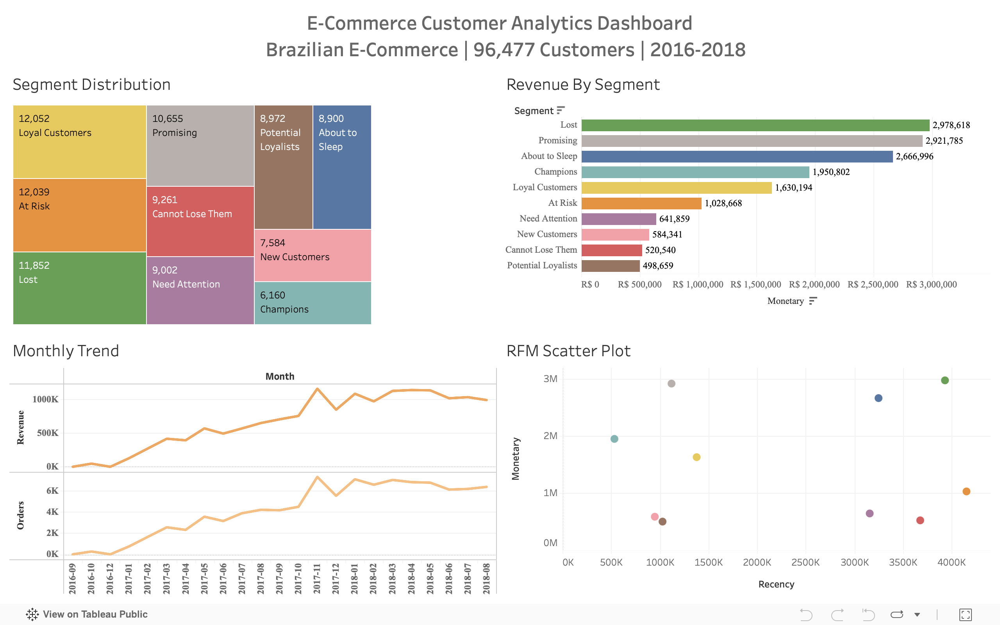

# E-Commerce Customer Analytics Dashboard


## 🔗 Live Dashboard

**[View Interactive Dashboard on Tableau Public →](https://public.tableau.com/app/profile/poorna.venkat.neelakantam/viz/E-CommerceCustomerAnalyticsDashboard/Dashboard1)**

---

## 📸 Dashboard Preview



---

## 📊 Overview

An interactive Tableau dashboard analyzing **96,477 customers** and **100,000+ orders** from a Brazilian e-commerce platform. The dashboard provides actionable insights for customer segmentation, revenue analysis, and retention strategy.

---

## 🎯 Key Visualizations

| Visualization | Purpose | Insight |
|---------------|---------|---------|
| **Segment Treemap** | Customer distribution by RFM segment | Lost customers are 12.3% of base |
| **Revenue Bar Chart** | Total revenue by customer segment | Lost = R$ 2.9M, Champions = R$ 1.9M |
| **Monthly Trend** | Revenue and order trends over time | 10x growth, November peak |
| **RFM Scatter Plot** | Segment positioning by Recency vs Monetary | Champions in bottom-right quadrant |

---

## 💡 Key Insights

| Metric | Value |
|--------|-------|
| Total Customers | 96,477 |
| Total Revenue | R$ 15.4M |
| Customer Segments | 10 |
| Analysis Period | 2016-2018 |

### Top 3 Business Findings:

1. **"Lost" customers hold R$ 2.9M** - Highest revenue segment needs win-back campaigns
2. **Champions are only 6.4%** - Opportunity to grow VIP customer base
3. **12,039 customers are "At Risk"** - Immediate retention action needed

---

## 🛠️ Data Sources

| File | Records | Purpose |
|------|---------|---------|
| `rfm_analysis_with_id.csv` | 96,477 | Customer RFM scores & segments |
| `customer_geography.csv` | 4,119 | Geographic distribution |
| `monthly_trend.csv` | 25 | Time series data |
| `segment_summary.csv` | 10 | Aggregated segment metrics |

---

## ⚙️ Dashboard Features

- **Interactive Filtering**: Click any segment to filter all charts
- **Tooltips**: Hover for detailed metrics
- **Responsive Design**: Works on desktop and tablet
- **Color-Coded Segments**: Consistent colors across all visualizations

---

## 📁 Files

```
01-ecommerce-customer-analytics/
├── README.md
├── screenshots/
│   └── ecommerce_dashboard.png
└── data/
    ├── rfm_analysis_with_id.csv
    ├── customer_geography.csv
    ├── monthly_trend.csv
    └── segment_summary.csv
```

---

## 🔗 Related Work

| Link | Description |
|------|-------------|
| 🗃️ [Full SQL Project](https://github.com/poornavenkatn08/SQL-Projects/tree/main/02-Ecommerce-Customer-Analytics) | Complete project with queries & documentation |
| 🐍 [Python Analysis](https://github.com/poornavenkatn08/Python_Pandas-Data-Analysis-Portfolio/tree/main/01-ecommerce-rfm-analysis) | RFM calculations & clustering notebooks |

---

## 👤 Author

**Poorna Venkat Neelakantam**
- [LinkedIn](https://linkedin.com/in/pneelakantam)
- [GitHub](https://github.com/poornavenkatn08)
- [Tableau Public](https://public.tableau.com/app/profile/poorna.venkat.neelakantam)
